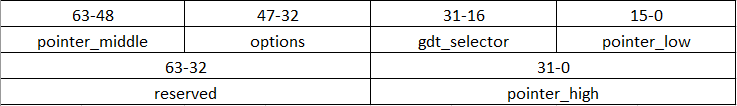
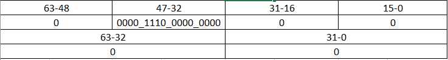
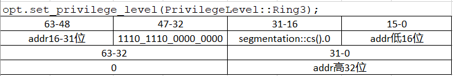
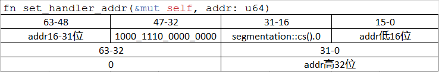

# zCore handle trapframe across kernel and user space

### zCore中trapframe的整体分析
While the kernel handles the system call, the application's CPU state is saved in a trap frame on the thread's kernel stack, and the CPU registers are available to hold kernel execution 、state.

当内核处理系统调用时，应用程序的CPU状态保存在线程内核栈的trap frame中，CPU寄存器就能够进入内核状态

Zircon是一个可以适应多种指令集的内核，在src/arch下，有四个目录，分别对应四种不同的CPU结构，它们是:
 - aarch64 (ARM architecture)
 - mipsel (MIPS architecture)
 - riscv (RISC-V)
 - x86_64 (64 bit version of x86 instruction set)

### x86_64架构的文件说明
file | description
---- | ---
fncall.rs | 在同一个状态中，因函数调用造成的上下文切换的实现
gdt.rs |  配置全局描述符表(GDT)
idt.rs |  配置中断描述符表(IDT)
ioport.rs |  I/O端口Permission
mod.rs |  公共模块?
syscall.rs |  系统调用的入口(通过它进入syscall.S)(未完成)
syscall.S |  汇编代码，执行系统调用处理
trap.rs |  处理内核中断的入口(通过它进入trap.S)(未完成)
trap.S |  汇编代码，执行中断处理

### trapframe for x86_64的实现分析

#### 初始化过程分析 
`pub unsafe fn init()`, 在x86_64架构下初始化中断处理

这个函数分为以下步骤:
1. 关闭x86_64中自带的中断功能  `x86_64::instructions::interrupts::disable();`

2. 初始化全局描述符表GDT(在GDT的分析中会详述它的实现)  `gdt::init();`

    - Switch to a new [GDT], extend 7 more entries from the current one. 
    - Switch to a new [TSS], set `GSBASE` to its base address.

3. 初始化中断描述符表IDT(在IDT的分析中会详述它的实现)  `idt::init();`
    - Switch to a new [IDT], override the current one.

4. 使能系统调用
    - Enable [`syscall`] instruction.
       - set `EFER::SYSTEM_CALL_EXTENSIONS`

[GDT]: https://wiki.osdev.org/GDT
[IDT]: https://wiki.osdev.org/IDT
[TSS]: https://wiki.osdev.org/Task_State_Segment
[`syscall`]: https://www.felixcloutier.com/x86/syscall

#### 完整代码如下：
```
pub unsafe fn init() {
    x86_64::instructions::interrupts::disable();
    gdt::init();
    idt::init();
    syscall::init();
}
```

#### 定义一个表示用户上下文的结构体
该结构体包含通用寄存器，陷阱号，错误代码

```
pub struct UserContext {
    pub general: GeneralRegs,
    pub trap_num: usize,
    pub error_code: usize,
}
```

为`UserContext`添加一些必要的方法:

`get_syscall_num(&self)`: 从rax中获取系统调用号

`get_syscall_ret(&self)`: 从rax中获取系统调用返回值

`set_syscall_ret(&mut self, ret: usize)`: 将系统调用返回值写入rax

`get_syscall_args(&self)`: 获取系统调用的参数

`set_ip(&mut self, ip: usize)`: 将指令寄存器的值设置为参数指定的地址

`set_sp(&mut self, sp: usize)`: 将栈指针寄存器的值设置为参数指定的地址

`get_sp(&self)`: 获取栈指针

`set_tls(&mut self, tls: usize)`: 将Thread Local Storage(TLS)写入fsbase

#### 通用寄存器

```
#[derive(Debug, Default, Clone, Copy, Eq, PartialEq)]
#[repr(C)]
pub struct GeneralRegs {
    pub rax: usize, 
    pub rbx: usize,
    pub rcx: usize,
    pub rdx: usize,
    pub rsi: usize,
    pub rdi: usize,
    pub rbp: usize,
    pub rsp: usize,
    pub r8: usize,
    pub r9: usize,
    pub r10: usize,
    pub r11: usize,
    pub r12: usize,
    pub r13: usize,
    pub r14: usize,
    pub r15: usize,
    pub rip: usize,
    pub rflags: usize,
    pub fsbase: usize,
    pub gsbase: usize,
}
```

寄存器|功能
---|---
rax|函数返回值
rbx|用作数据存储，遵循被调用者使用规则
rcx|用作函数参数，第四个参数
rdx|用作函数参数，第三个参数
rsi|用作函数参数，第二个参数
rdi|用作函数参数，第一个参数
rbp|用作数据存储，遵循被调用者使用规则
rsp|栈指针寄存器，指向栈顶
r8|用作函数参数，第五个参数
r9|用作函数参数，第六个参数
r10|用作数据存储，遵循调用者使用规则
r11|用作数据存储，遵循调用者使用规则
r12|用作数据存储，遵循被调用者使用规则
r13|用作数据存储，遵循被调用者使用规则
r14|用作数据存储，遵循被调用者使用规则
r15|用作数据存储，遵循被调用者使用规则
rip|指令寄存器
rflags|64位标志寄存器
[fsbase](https://wiki.osdev.org/SWAPGS)|Their base addresses are used to calculate effective addresses. FS is used for Thread Local Storage. 
[gsbase](https://wiki.osdev.org/SWAPGS)|Their base addresses are used to calculate effective addresses. The GS register often holds a base address to a structure containing per-CPU data.

------

### 配置全局描述符表GDT的实现分析

#### 定义TSS类型

```
/// 如果编译时没有参数"ioport_bitmap", 则将TSS设置为x86_64结构下的TaskStateSegment
#[cfg(not(feature = "ioport_bitmap"))]
type TSS = x86_64::structures::tss::TaskStateSegment;

/// 如果编译时有参数"ioport_bitmap", 则将TSS设置为TSSWithPortBitmap
#[cfg(feature = "ioport_bitmap")]
type TSS = super::ioport::TSSWithPortBitmap;
```

#### 初始化TSS与GDT
```
pub fn init() {
}
```
在这个函数中：
为trap分配栈，将栈顶设置为tss，这样一来，从ring3切换到ring0，CPU可以正确地切换栈
代码如下
```
/// 新建一个位于堆上的TSS结构，并创建一个位于栈中的指针tss指向它
/// https://docs.rs/x86_64/0.1.1/x86_64/structures/tss/struct.TaskStateSegment.html

let mut tss = Box::new(TSS::new());


/// 在堆中新建一个0x1000大小的数组，用于模拟栈，使用`Box::leak().as_ptr()`获取这个数组的起始地址，再加0x1000的偏移，就获得了这个模拟栈的栈顶

let trap_stack_top = Box::leak(Box::new([0u8; 0x1000])).as_ptr() as u64 + 0x1000;

/// 将栈顶设置为tss的privilege_stack_table
tss.privilege_stack_table[0] = VirtAddr::new(trap_stack_top);

/// 解开Box, 获取tss的数据 ***？
let tss: &'static _ = Box::leak(tss);

/// Creates a TSS system descriptor for the given TSS. 如果不能返回System Segment, 那么panic
/// tss0与tss1:
/// tss0: 按descriptor格式重写的栈顶地址
/// 如何理解tss1？
let (tss0, tss1) = match Descriptor::tss_segment(tss) {
        Descriptor::SystemSegment(tss0, tss1) => (tss0, tss1),
        _ => unreachable!(),
    };

// Extreme hack: the segment limit assumed by x86_64 does not include the port bitmap.
    #[cfg(feature = "ioport_bitmap")]
    let tss0 = (tss0 & !0xFFFF) | (size_of::<TSS>() as u64);

    unsafe {
        // get current GDT
        let gdtp = sgdt();
        let entry_count = (gdtp.limit + 1) as usize / size_of::<u64>();

    /// old_gdt: 一个slice, 从现有的gdt的base地址开始, 取entry_count个值
        let old_gdt = core::slice::from_raw_parts(gdtp.base as *const u64, entry_count);

        // allocate new GDT with 7 more entries
        //
        // NOTICE: for fast syscall:
        //   STAR[47:32] = K_CS   = K_SS - 8
        //   STAR[63:48] = U_CS32 = U_SS32 - 8 = U_CS - 16
        let mut gdt = Vec::from(old_gdt);
        gdt.extend([tss0, tss1, KCODE64, KDATA64, UCODE32, UDATA32, UCODE64].iter());
        let gdt = Vec::leak(gdt);


        // load new GDT and TSS
        lgdt(&DescriptorTablePointer {
            limit: gdt.len() as u16 * 8 - 1,
            base: gdt.as_ptr() as _,
        });

    /// SegmentSelector: a index to LDT or GDT table with some additional flags
    /// Load the task state register using the ltr instruction
        load_tss(SegmentSelector::new(
            entry_count as u16,
            PrivilegeLevel::Ring0,
        ));

        // for fast syscall:
        // store address of TSS to kernel_gsbase
        GsBase::MSR.write(tss as *const _ as u64);

        Star::write_raw(
            SegmentSelector::new(entry_count as u16 + 4, PrivilegeLevel::Ring3).0,
            SegmentSelector::new(entry_count as u16 + 2, PrivilegeLevel::Ring0).0,
        );
    }

```

#### 获取当前GDTR内容
```
/// Get current GDT register
#[inline]
unsafe fn sgdt() -> DescriptorTablePointer {
    let mut gdt = DescriptorTablePointer { limit: 0, base: 0 };
    asm!("sgdt [{}]", in(reg) &mut gdt);
    gdt
}
```

#### 定义了一些全局描述符
全局描述符表(GDT), It contains entries telling the CPU about memory segments. A similar Interrupts Descriptor Table exists containing tasks and interrupts descriptors.


```
const KCODE64: u64 = 0x00209800_00000000; // EXECUTABLE | USER_SEGMENT | PRESENT | LONG_MODE
const UCODE64: u64 = 0x0020F800_00000000; // EXECUTABLE | USER_SEGMENT | USER_MODE | PRESENT | LONG_MODE
const KDATA64: u64 = 0x00009200_00000000; // DATA_WRITABLE | USER_SEGMENT | PRESENT
#[allow(dead_code)]
const UDATA64: u64 = 0x0000F200_00000000; // DATA_WRITABLE | USER_SEGMENT | USER_MODE | PRESENT
const UCODE32: u64 = 0x00cffa00_0000ffff; // EXECUTABLE | USER_SEGMENT | USER_MODE | PRESENT
const UDATA32: u64 = 0x00cff200_0000ffff; // EXECUTABLE | USER_SEGMENT | USER_MODE | PRESENT
```

以上述代码中的KCODE64为例分析:

<table border=0 cellpadding=0 cellspacing=0 width=576 style='border-collapse:
 collapse;table-layout:fixed;width:432pt'>
 <col width=64 span=9 style='width:48pt'>
 <tr height=19 style='height:14.4pt'>
  <td colspan=4 height=19 class=xl68 width=256 style='height:14.4pt;width:192pt'>Base
  0:15</td>
  <td colspan=4 class=xl69 width=256 style='border-left:none;width:192pt'>Limit
  0:15</td>
  <td width=64 style='width:48pt'></td>
 </tr>
 <tr height=19 style='height:14.4pt'>
  <td height=19 class=xl66 style='height:14.4pt;border-top:none'>0000</td>
  <td class=xl66 style='border-top:none;border-left:none'>0000</td>
  <td class=xl66 style='border-top:none;border-left:none'>0000</td>
  <td class=xl66 style='border-top:none;border-left:none'>0000</td>
  <td class=xl66 style='border-top:none;border-left:none'>0000</td>
  <td class=xl66 style='border-top:none;border-left:none'>0000</td>
  <td class=xl66 style='border-top:none;border-left:none'>0000</td>
  <td class=xl66 style='border-top:none;border-left:none'>0000</td>
  <td></td>
 </tr>
 <tr height=19 style='height:14.4pt'>
  <td colspan=2 height=19 class=xl70 style='height:14.4pt'>Base 24:31</td>
  <td class=xl66 style='border-top:none;border-left:none'>Flags</td>
  <td class=xl71 style='border-top:none;border-left:none'>Limit 16:19</td>
  <td colspan=2 class=xl72 style='border-left:none'>Access Byte</td>
  <td colspan=2 class=xl70 style='border-left:none'>Base 16:23</td>
  <td></td>
 </tr>
 <tr height=19 style='height:14.4pt'>
  <td height=19 class=xl66 style='height:14.4pt;border-top:none'>0000</td>
  <td class=xl66 style='border-top:none;border-left:none'>0000</td>
  <td class=xl67 style='border-top:none;border-left:none'>0010</td>
  <td class=xl67 style='border-top:none;border-left:none'>0000</td>
  <td class=xl67 style='border-top:none;border-left:none'>1001</td>
  <td class=xl67 style='border-top:none;border-left:none'>1000</td>
  <td class=xl66 style='border-top:none;border-left:none'>0000</td>
  <td class=xl66 style='border-top:none;border-left:none'>0000</td>
  <td></td>
 </tr>
 <tr height=19 style='height:14.4pt'>
  <td height=19 colspan=9 style='height:14.4pt;mso-ignore:colspan'></td>
 </tr>
 <tr height=19 style='height:14.4pt'>
  <td height=19 class=xl75 style='height:14.4pt'>Base:</td>
  <td class=xl74>0</td>
  <td class=xl65></td>
  <td class=xl65></td>
  <td class=xl65></td>
  <td class=xl65></td>
  <td class=xl65></td>
  <td class=xl65></td>
  <td class=xl65></td>
 </tr>
 <tr height=19 style='height:14.4pt'>
  <td height=19 class=xl73 style='height:14.4pt;border-top:none'>&nbsp;</td>
  <td class=xl100>&nbsp;</td>
  <td class=xl65></td>
  <td class=xl65></td>
  <td class=xl65></td>
  <td class=xl65></td>
  <td class=xl65></td>
  <td class=xl65></td>
  <td class=xl65></td>
 </tr>
 <tr height=19 style='height:14.4pt'>
  <td height=19 class=xl101 style='height:14.4pt'>Limit:</td>
  <td class=xl76>0</td>
  <td class=xl65></td>
  <td class=xl65></td>
  <td class=xl65></td>
  <td class=xl65></td>
  <td class=xl65></td>
  <td class=xl65></td>
  <td class=xl65></td>
 </tr>
 <tr height=19 style='height:14.4pt'>
  <td height=19 class=xl102 style='height:14.4pt;border-top:none'>&nbsp;</td>
  <td class=xl104>&nbsp;</td>
  <td class=xl65></td>
  <td class=xl65></td>
  <td class=xl65></td>
  <td class=xl65></td>
  <td class=xl65></td>
  <td class=xl65></td>
  <td class=xl65></td>
 </tr>
 <tr height=19 style='height:14.4pt'>
  <td colspan=2 rowspan=2 height=38 class=xl79 style='border-right:.5pt solid black;
  border-bottom:.5pt solid black;height:28.8pt'>Access Byte:</td>
  <td class=xl82>Pr</td>
  <td class=xl77 style='border-left:none'>Privl</td>
  <td class=xl77 style='border-left:none'>S</td>
  <td class=xl77 style='border-left:none'>EX</td>
  <td class=xl77 style='border-left:none'>DC</td>
  <td class=xl77 style='border-left:none'>RW</td>
  <td class=xl77 style='border-left:none'>AC</td>
 </tr>
 <tr height=19 style='height:14.4pt'>
  <td height=19 class=xl82 style='height:14.4pt;border-top:none'>1</td>
  <td class=xl78 style='border-top:none;border-left:none'>00</td>
  <td class=xl77 style='border-top:none;border-left:none'>1</td>
  <td class=xl77 style='border-top:none;border-left:none'>1</td>
  <td class=xl77 style='border-top:none;border-left:none'>0</td>
  <td class=xl77 style='border-top:none;border-left:none'>0</td>
  <td class=xl77 style='border-top:none;border-left:none'>0</td>
 </tr>
 <tr height=19 style='height:14.4pt'>
  <td height=19 class=xl83 style='height:14.4pt'>&nbsp;</td>
  <td class=xl84>&nbsp;</td>
  <td colspan=7 class=xl89 style='border-bottom:.5pt solid black;border-left:
  none'>Present bit, must be 1</td>
 </tr>
 <tr height=19 style='height:14.4pt'>
  <td height=19 class=xl85 style='height:14.4pt'>&nbsp;</td>
  <td class=xl65></td>
  <td class=xl90 style='border-top:none'>&nbsp;</td>
  <td colspan=6 class=xl91 style='border-bottom:.5pt solid black'>Privilege, 2
  bits,ring level. 00=highest(user applications)</td>
 </tr>
 <tr height=19 style='height:14.4pt'>
  <td height=19 class=xl85 style='height:14.4pt'>&nbsp;</td>
  <td></td>
  <td class=xl92>&nbsp;</td>
  <td class=xl93 style='border-top:none'>&nbsp;</td>
  <td colspan=5 class=xl91 style='border-bottom:.5pt solid black'>Descripter
  Type. Set 1 for code or data segments</td>
 </tr>
 <tr height=19 style='height:14.4pt'>
  <td height=19 class=xl85 style='height:14.4pt'>&nbsp;</td>
  <td></td>
  <td class=xl92>&nbsp;</td>
  <td class=xl94></td>
  <td class=xl93 style='border-top:none'>&nbsp;</td>
  <td colspan=4 class=xl91 style='border-bottom:.5pt solid black'>Executable
  bit. 1 for executable</td>
 </tr>
 <tr height=19 style='height:14.4pt'>
  <td height=19 class=xl85 style='height:14.4pt'>&nbsp;</td>
  <td></td>
  <td class=xl92>&nbsp;</td>
  <td class=xl94></td>
  <td class=xl94></td>
  <td class=xl93 style='border-top:none'>&nbsp;</td>
  <td colspan=3 class=xl91 style='border-bottom:.5pt solid black'>Direction
  bit. 0 grows up.</td>
 </tr>
 <tr height=19 style='height:14.4pt'>
  <td height=19 class=xl85 style='height:14.4pt'>&nbsp;</td>
  <td></td>
  <td class=xl92>&nbsp;</td>
  <td class=xl94></td>
  <td class=xl94></td>
  <td class=xl94></td>
  <td class=xl93 style='border-top:none'>&nbsp;</td>
  <td colspan=2 class=xl91 style='border-bottom:.5pt solid black'>Readable/Writable</td>
 </tr>
 <tr height=19 style='height:14.4pt'>
  <td height=19 class=xl86 style='height:14.4pt'>&nbsp;</td>
  <td></td>
  <td class=xl95>&nbsp;</td>
  <td class=xl96>&nbsp;</td>
  <td class=xl96>&nbsp;</td>
  <td class=xl96>&nbsp;</td>
  <td class=xl96>&nbsp;</td>
  <td class=xl97 style='border-top:none'>&nbsp;</td>
  <td class=xl98 style='border-top:none'>Accessed bit.</td>
 </tr>
 <tr height=19 style='height:14.4pt'>
  <td height=19 class=xl86 style='height:14.4pt'>&nbsp;</td>
  <td class=xl107>&nbsp;</td>
  <td class=xl96>&nbsp;</td>
  <td class=xl96>&nbsp;</td>
  <td class=xl96>&nbsp;</td>
  <td class=xl96>&nbsp;</td>
  <td class=xl94></td>
  <td class=xl94></td>
  <td class=xl105></td>
 </tr>
 <tr height=19 style='height:14.4pt'>
  <td colspan=2 rowspan=2 height=38 class=xl99 style='height:28.8pt'>Flags:</td>
  <td class=xl88 style='border-top:none;border-left:none'>Gr</td>
  <td class=xl88 style='border-top:none;border-left:none'>Sz</td>
  <td class=xl88 style='border-top:none;border-left:none'>0</td>
  <td class=xl88 style='border-top:none;border-left:none'>0</td>
  <td colspan=3 style='mso-ignore:colspan'></td>
 </tr>
 <tr height=19 style='height:14.4pt'>
  <td height=19 class=xl99 style='height:14.4pt;border-top:none;border-left:
  none'>0</td>
  <td class=xl99 style='border-top:none;border-left:none'>0</td>
  <td class=xl99 style='border-top:none;border-left:none'>1</td>
  <td class=xl99 style='border-top:none;border-left:none'>0</td>
  <td colspan=3 style='mso-ignore:colspan'></td>
 </tr>
 <![if supportMisalignedColumns]>
 <tr height=0 style='display:none'>
  <td width=64 style='width:48pt'></td>
  <td width=64 style='width:48pt'></td>
  <td width=64 style='width:48pt'></td>
  <td width=64 style='width:48pt'></td>
  <td width=64 style='width:48pt'></td>
  <td width=64 style='width:48pt'></td>
  <td width=64 style='width:48pt'></td>
  <td width=64 style='width:48pt'></td>
  <td width=64 style='width:48pt'></td>
 </tr>
 <![endif]>
</table>

------

### 配置中断描述符表的IDT的实现分析
#### 中断描述符表的结构

| Entry | description |
| - | - |
| `pub divide_by_zero: Entry<HandlerFunc>` | 	A divide by zero exception (`#DE`) occurs when the denominator of a DIV instruction or an IDIV instruction is 0. A `#DE` also occurs if the result is too large to be represented in the destination. |
|`pub debug: Entry<HandlerFunc>` | <br> Instruction execution. <br>Instruction single stepping. <br>Data read. <br>Data write. <br>I/O read. <br>I/O write. <br>Task switch. <br>Debug-register access, or general detect fault" |
| `pub non_maskable_interrupt: Entry<HandlerFunc>` |	An non maskable interrupt exception (NMI) occurs as a result of system logic signaling a non-maskable interrupt to the processor. |
| `pub breakpoint: Entry<HandlerFunc>` | 	A breakpoint (`#BP`) exception occurs when an `INT3` instruction is executed.|
| `pub overflow: Entry<HandlerFunc>` |	An overflow exception (`#OF`) occurs as a result of executing an `INTO` instruction while the overflow bit in `RFLAGS` is set to 1.|
| `pub bound_range_exceeded: Entry<HandlerFunc>` |	A bound-range exception (`#BR`) exception can occur as a result of executing the `BOUND` instruction.|
| `pub invalid_opcode: Entry<HandlerFunc>` |	An invalid opcode exception (`#UD`) occurs when an attempt is made to execute an  invalid or undefined opcode.|
| `pub device_not_available: Entry<HandlerFunc>` |	"A device not available exception (`#NM`) occurs under any of the following conditions:     <br>- An `FWAIT`/`WAIT` instruction is executed when `CR0.MP=1` and `CR0.TS=1`.     <br>- Any x87 instruction other than `FWAIT` is executed when `CR0.EM=1`.   <br>- Any x87 instruction is executed when `CR0.TS=1`. The `CR0.MP` bit controls whether the  `FWAIT`/`WAIT` instruction causes an `#NM` exception when `TS=1`.     <br>- Any 128-bit or 64-bit media instruction when `CR0.TS=1`."|
| `pub double_fault: Entry<HandlerFuncWithErrCode>`|	A double fault (`#DF`) exception can occur when a second exception occurs during the handling of a prior (first) exception or interrupt handler.|
|`coprocessor_segment_overrun: Entry<HandlerFunc>`|	This interrupt vector is reserved. It is for a discontinued exception originally used by processors that supported external x87-instruction coprocessors.|
|`pub invalid_tss: Entry<HandlerFuncWithErrCode>`|	An invalid TSS exception (`#TS`) occurs only as a result of a control transfer through a gate descriptor that results in an invalid stack-segment reference using an `SS` selector in the TSS.|
|`pub segment_not_present: Entry<HandlerFuncWithErrCode>`|	An segment-not-present exception (`#NP`) occurs when an attempt is made to load a segment or gate with a clear present bit.|
| `pub stack_segment_fault: Entry<HandlerFuncWithErrCode>`| "An stack segment exception (`#SS`) can occur in the following situations: <br> - Implied stack references in which the stack address is not in canonical form. Implied stack references include all push and pop instructions, and any instruction using `RSP` or `RBP` as a base register. <br> - Attempting to load a stack-segment selector that references a segment descriptor containing a clear present bit. <br> - Any stack access that fails the stack-limit check."|
|`pub general_protection_fault: Entry<HandlerFuncWithErrCode>`|	"A general protection fault (`#GP`) can occur in various situations. Common causes include: <br>- Executing a privileged instruction while `CPL > 0`. <br>- Writing a 1 into any register field that is reserved, must be zero (MBZ). <br>- Attempting to execute an SSE instruction specifying an unaligned memory operand. <br>- Loading a non-canonical base address into the `GDTR` or `IDTR`. <br>- Using WRMSR to write a read-only MSR. <br>- Any long-mode consistency-check violation."|
| `pub page_fault: Entry<PageFaultHandlerFunc>`|	"A page fault (`#PF`) can occur during a memory access in any of the following situations: <br>- A page-translation-table entry or physical page involved in translating the memory access is not present in physical memory. This is indicated by a cleared present bit in the translation-table entry. <br>- An attempt is made by the processor to load the instruction TLB with a translation for a non-executable page. <br>- The memory access fails the paging-protection checks (user/supervisor, read/write, or both). <br>- A reserved bit in one of the page-translation-table entries is set to 1. A `#PF` occurs for this reason only when `CR4.PSE=1` or `CR4.PAE=1`."|
|`reserved_1: Entry<HandlerFunc>`|	reserved|
|`pub x87_floating_point: Entry<HandlerFunc>`|	The x87 Floating-Point Exception-Pending exception (`#MF`) is used to handle unmasked x87 floating-point exceptions.|
|`pub alignment_check: Entry<HandlerFuncWithErrCode>`|	An alignment check exception (`#AC`) occurs when an unaligned-memory data reference is performed while alignment checking is enabled.|
|`pub machine_check: Entry<HandlerFunc>`|	The machine check exception (`#MC`) is model specific. Processor implementations are not required to support the `#MC` exception, and those implementations that do support `#MC` can vary in how the `#MC` exception mechanism works.|
| `pub simd_floating_point: Entry<HandlerFunc>`|	"The SIMD Floating-Point Exception (`#XF`) is used to handle unmasked SSE floating-point exceptions. The SSE floating-point exceptions reported by the `#XF` exception are (including mnemonics): <br>- IE: Invalid-operation exception (also called #I). <br>- DE: Denormalized-operand exception (also called #D). <br>- ZE: Zero-divide exception (also called #Z). <br>- OE: Overflow exception (also called #O). <br>- UE: Underflow exception (also called #U). <br>- PE: Precision exception (also called #P or inexact-result exception)."|
| `pub virtualization: Entry<HandlerFunc>` |	virtualization|
| `reserved_2: [Entry<HandlerFunc>; 9]`|	reserved|
| `reserved_2: [Entry<HandlerFunc>; 9]`|	reserved|
| `reserved_2: [Entry<HandlerFunc>; 9]`|	reserved|
| `reserved_2: [Entry<HandlerFunc>; 9]`|	reserved|
| `reserved_2: [Entry<HandlerFunc>; 9]`|	reserved|
| `reserved_2: [Entry<HandlerFunc>; 9]`|	reserved|
| `reserved_2: [Entry<HandlerFunc>; 9]`|	reserved|
| `reserved_2: [Entry<HandlerFunc>; 9]`|	reserved|
| `reserved_2: [Entry<HandlerFunc>; 9]`|	reserved|
| `pub security_exception: Entry<HandlerFuncWithErrCode>`|	The Security Exception (`#SX`) signals security-sensitive events that occur while executing the VMM, in the form of an exception so that the VMM may take appropriate action.|
| `interrupts: [Entry<HandlerFunc>; 256 - 32]` | interupts|


#### Entry 的结构



#### New：Creates a new IDT filled with non-present entries.


#### 初始化函数
```
pub fn init() {
    extern "C" {

    /// 引用汇编程序vector.S(由build.rs生成)中的中断向量表
        #[link_name = "__vectors"]
    /// 申请一个VECTOR, 由256个C函数指针组成, 函数指针指向vector.S中的中断向量表
        static VECTORS: [extern "C" fn(); 256];
    }


    /// 新建中断描述符表(filled with non-present entries)
    let idt = Box::leak(Box::new(InterruptDescriptorTable::new()));


    /// 申请一个entries，然后从idt中把内容transmute_copy过来，
    /// transmute_copy 的说明：pub unsafe fn transmute_copy<T, U>(src: &T) -> U
    /// Interprets src as having type &U, and then reads src without moving the contained value.
    
    let entries: &'static mut [Entry<HandlerFunc>; 256] =
        unsafe { core::mem::transmute_copy(&idt) };
    
    /// 将VECTORS中的函数指针写入对应的entries中, 并设置存在位
    /// Set the handler address for the IDT entry and sets the present bit. 
    /// 其中, 中断3, 4与其他的区别在于优先级为最低, 见figure_3和figure_4
    for i in 0..256 {
        let opt = entries[i].set_handler_fn(unsafe { core::mem::transmute(VECTORS[i]) });
        // Enable user space `int3` and `into`
        if i == 3 || i == 4 {
            opt.set_privilege_level(PrivilegeLevel::Ring3);
        }
    }
    
    /// load idt
    idt.load();
}
```

#### 中断3,4与其他中断

中断3和4的entrys的示意图


其他中断的entrys的示意图



#### 获取当前IDT寄存器中的数据

```
/// Get current IDT register

/// function sidt(): Get current IDT register; return: DescriptorTablePointer
fn sidt() -> DescriptorTablePointer {
    let mut dtp = DescriptorTablePointer { limit: 0, base: 0 };
    unsafe {
        asm!("sidt [{}]", in(reg) &mut dtp);
    }
    dtp
}
```

------

### 通过函数调用实现的上下文切换fncall的分析
[fncall的实现分析](./ch06-02-zcore-libos-unix.md#通过函数调用的上下文切换的实现fncall)
